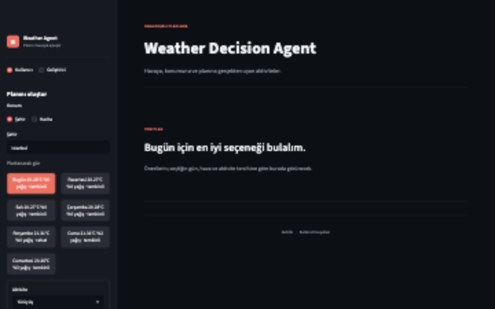
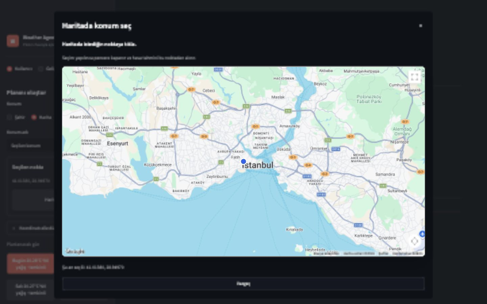
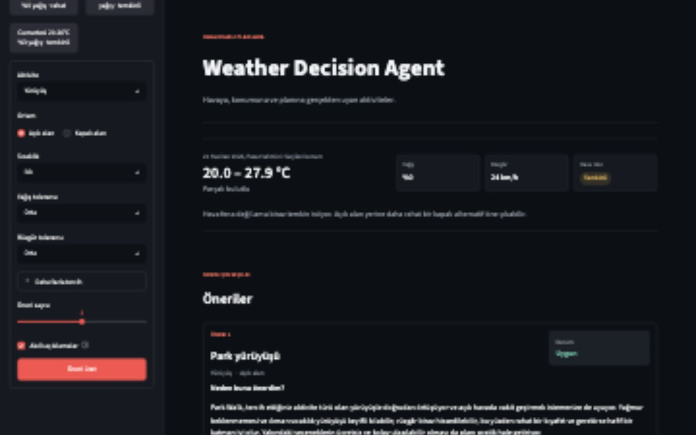
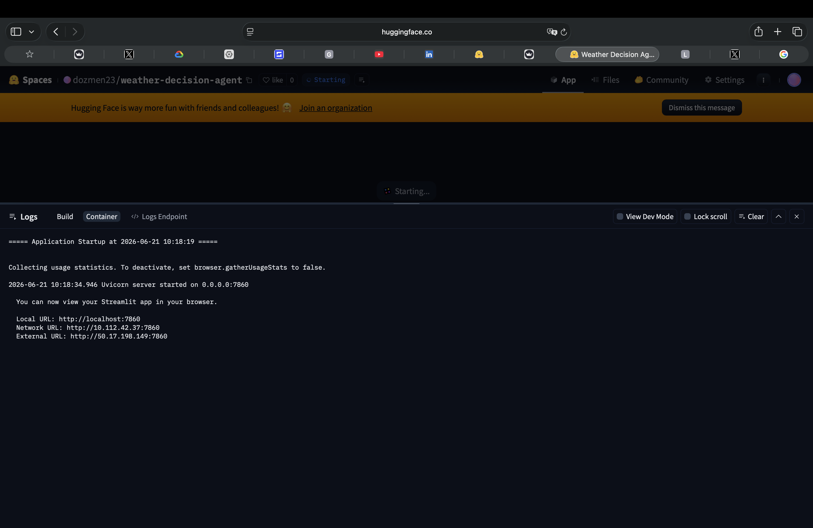

# Weather Decision Agent

Weather Decision Agent, hava durumu ve kullanıcı tercihlerini analiz ederek
uygun aktivite önerileri üretmeyi amaçlayan bir Agentic AI projesidir.

## Final Project Report

**Team:** Deniz Özmen (2203032) · Ömer Şahin (2104101)<br>
**Live application:** [Weather Decision Agent](https://dozmen23-weather-decision-agent.hf.space/)<br>
**Downloadable report:** [Weather Decision Agent Final Project Report](docs/Weather_Decision_Agent_Final_Report.docx)

### Additional Reports

- [Executive Summary](docs/executive_summary.md)
- [Practitioner Notes](docs/practitioner_notes.md)

### 1. Motivation

Modern weather applications usually show raw values, but they still leave the
final decision to the user. The Weather Decision Agent was proposed to turn
temperature, rain and wind data into a simple answer: **What can I comfortably
do today?**

### 2. Problem Definition

This is a decision-making problem under uncertainty. Weather conditions change,
several variables must be considered together, and two users may react
differently to the same forecast. The project therefore combines decision
support, context-aware recommendation and agentic AI concepts.

### 3. Project Overview

The original plan was a Python and Streamlit application that would collect
weather data, read user preferences, evaluate a catalog of activities and return
ranked recommendations with short explanations.

The first technical design expected OpenWeatherMap and a GPT-4o mini based
decision agent. During development, this structure was deliberately changed to
make the system safer, easier to test and less dependent on the language model.

### 4. Initial System Workflow

The planned workflow started with location and preference inputs. Weather data
would then be normalized, combined with activity options and sent to the
decision agent. The final output would contain ranked activities and a short
reason for each recommendation.

### 5. Team Responsibilities

Deniz Özmen focused on the decision workflow, recommendation rules, LLM
integration and the preference experience. Ömer Şahin focused on weather data
collection, normalization, structured activity data and connecting the service
layer to the Streamlit output.

### 6. From Initial Plan to Final Product

The project kept its original goal, but the implementation became more
controlled and much closer to a real product.

| Area | Initial plan | Final implementation |
| --- | --- | --- |
| Weather | OpenWeatherMap | Open-Meteo and 7-day forecast |
| Main decision | LLM-based ranking | Deterministic rules and scoring |
| LLM role | Choose activities | Explain and review only |
| Location | City input | City or Google Maps selection |
| Venues | Static activity options | Verified Google Places results |
| Interface | Single Streamlit screen | User Mode and Developer Mode |
| Deployment | Local Streamlit app | Docker Space on Hugging Face |

### 7. Final Implementation Update

The final version is a hybrid decision system. Weather safety, scoring and
fallback rules are deterministic. The LLM cannot change a safety rule or score;
it only turns the result into a natural explanation and acts as a second
reviewer.

#### 7.1 Weather Risk and Scoring

Rain, wind, temperature and weather condition are combined into four
user-friendly risk labels: comfortable, cautious, risky and very risky.
Recommendations also keep a clear score breakdown for weather safety,
preference match, comfort and practicality.

#### 7.2 Smarter Fallback Logic

The system first searches for an exact activity match. If the weather makes
that option unsafe, it looks for a close indoor alternative instead of
returning a random activity. For example, an outdoor walk can become an indoor
track or mall walk.

### 8. User Experience

User Mode keeps the screen simple: seven forecast cards, understandable
preference controls and a short explanation written in everyday language.
Developer Mode is kept separate and shows the trace, scoring details, raw
weather data and evaluator output when technical inspection is needed.



*Figure 1. Final User Mode with seven-day forecast cards and simple preferences.*

### 9. Map and Real Venue Integration

Users can enter a city or select any point directly on Google Maps. The selected
coordinates are used both for the weather forecast and for nearby venue
searches. Real venue results come from Google Places; the LLM is not allowed to
invent a location.



*Figure 2. Google Maps location picker running in the deployed application.*

### 10. Recommendation Output

The result explains the weather first, then shows the selected activity, why it
fits and what the user should pay attention to. When available, verified nearby
venues are displayed with distance, accessibility and a direct Google Maps
link.



*Figure 3. Final recommendation with a friendly explanation and verified venue results.*

### 11. Evaluation and Safety

The project includes automated tests and reusable evaluation scenarios for
thunderstorms, high wind, extreme temperature, light rain, exact preference
matches and cases where no safe activity exists. The current suite contains
**159 passing tests**.

LLM safety checks also cover invented activities, changed scores and unsafe
suggestions. If the model output is invalid, the deterministic recommendation
remains the source of truth.

### 12. Deployment

The application is packaged with Docker and deployed publicly on Hugging Face
Spaces. GitHub Actions automatically synchronizes every push to the `main`
branch, so approved code changes can reach the live demo without a manual
upload.



*Figure 4. Hugging Face container logs showing the Streamlit service on port 7860.*

### 13. Final Architecture

In simple terms, the user chooses a place and preferences, Open-Meteo provides
the forecast, the deterministic agent selects safe activities, Google Places
returns real venues and the LLM explains the already-approved result. Streamlit
brings these parts together in one interface.

```text
User preferences and location
            ↓
Open-Meteo weather forecast
            ↓
Deterministic safety, fallback and scoring
            ↓
Google Places verified venue results
            ↓
LLM-assisted explanation and second review
            ↓
Streamlit User Mode / Developer Mode
```

### 14. Conclusion

The final Weather Decision Agent goes beyond displaying weather. It turns a
forecast into a practical plan while keeping safety decisions transparent and
testable. The result is a small but complete agentic AI product: useful for the
user, inspectable for the developer and available through a public demo link.

## Mevcut Kabiliyetler

- Open-Meteo üzerinden güncel hava durumu ve yedi günlük tahmin verisi alır.
- Şehir adı veya doğrudan koordinat üzerinden hava verisi alabilecek servis
  altyapısına sahiptir.
- Streamlit'te şehir ya da harita modu seçilebilir; harita modunda kullanıcı
  Google Maps üzerinden bir noktaya tıklayıp aynı öneri akışını çalıştırır.
  Tarayıcı anahtarı ayarlanmamışsa konum seçimi kontrollü olarak demo haritaya
  düşebilir.
- Kullanıcının şehir, tarih, aktivite ve konfor tercihlerini değerlendirir.
- Bütçe, süre, yoğunluk ve rezervasyon istemiyorum tercihlerini filtre olarak
  uygular.
- Katılımcı tercihini tek başıma, arkadaşla veya aileyle şeklinde dikkate alır.
- Ulaşım kolaylığı tercihini aktivite düzeyinde dikkate alır; bu alan ileride
  harita veya gerçek mekan verisiyle beslenebilir.
- Kontrollü demo mekan veri kaynağından doğrulanmış mekan adayları gösterebilir;
  haritada seçilen noktaya göre mekan mesafelerini yeniden hesaplar ve adayları
  haritada marker olarak gösterebilir.
- Developer Mode'da mekan filtre izini gösterir; hangi mekanın hangi nedenle
  elendiği veya geçtiği görülebilir.
- Mekan kaynağı provider mimarisiyle ayrılmıştır; JSON demo provider, static
  test provider, generic external provider ve Google Places provider sınırı
  vardır.
- `VENUE_PROVIDER=json`, `VENUE_PROVIDER=google_places` ve opsiyonel
  `VENUE_JSON_PATH` ayarlarıyla mekan kaynağı merkezi olarak seçilebilir.
- Google Places modunda Nearby Search, haritada seçilen koordinata göre çalışır;
  API key `.env` içindeki `GOOGLE_PLACES_API_KEY` üzerinden okunur.
- Google Places mekanları Google Maps üzerinde gösterilir, Google Maps kaynak
  bilgisi ve doğrulanmış Google Maps bağlantısı mekan kartında korunur.
- Spor mekanları yalnızca geniş kategoriyle aranmaz; yüzme, tırmanış, saha
  antrenmanı, basketbol, tenis ve kapalı bisiklet için aktiviteye özel Google
  place type niyetleri kullanılır. Alternatif bulunduğunda aynı mekanın farklı
  öneri kartlarında tekrarlanması azaltılır.
- Hava ve pratiklik filtrelerini teknik sayı girişi yerine doğal seviye
  seçenekleriyle toplar.
- Yedi günlük tahmini kartlı gün seçiciyle gösterir.
- Aktivite kataloğunu deterministik güvenlik kurallarından geçirir.
- Önce tam eşleşmeleri, ardından yakın kapalı alan alternatiflerini dener.
- Kritik kategorilerde açık alan ve kapalı alan alternatiflerinin birlikte
  kalmasını otomatik testlerle güvenceye alır.
- Hava koşullarından `LOW`, `MODERATE`, `HIGH`, `SEVERE` risk seviyesi üretir.
- Önerileri hava güvenliği, tercih eşleşmesi, konfor ve pratiklik kırılımıyla
  puanlar.
- Güvenli bir sonuç bulunamazsa kontrollü şekilde durur.
- Katalog güvenli sonuç bulamazsa LLM'den kontrollü aktivite adayları alabilir;
  bu adaylar da aynı deterministik güvenlik kurallarından geçmeden önerilmez.
- LLM alakasız aktivite üretirse, öneri açıklamasında aday uydurursa veya
  geçersiz sonucu onaylamaya çalışırsa testlerle reddedilir.
- Opsiyonel OpenAI entegrasyonu ile sonucu açıklar ve ikinci hakem görüşü üretir.
- Streamlit arayüzü üzerinden öneri akışını çalıştırır.
- Streamlit'te User Mode ile sade öneri akışı, Developer Mode ile evaluator,
  trace, raw hava verisi ve score breakdown detayları gösterir.
- User Mode öneri kartlarında "Neden bunu önerdim?" ve "Dikkat et" bölümleri
  kullanıcı diliyle gösterilir.
- Fallback açıklamaları yağış, rüzgâr, sıcaklık ve risk sınırlarını
  kullanıcı diliyle belirtir.
- Geçmiş ekranı User Mode'da sade öneri geçmişi, Developer Mode'da raw kayıt
  ve debug bilgileri olarak ayrılır.
- Developer Mode'da evaluation dashboard üzerinden kayıtlı senaryolar
  çalıştırılıp pass/fail sonuçları görülebilir.
- Katalogdaki aktivite adları ve aktivite türleri User Mode'da Türkçe
  etiketlerle gösterilir.
- Reproducible evaluation senaryolarıyla exact match, fallback, güvenli durma,
  coordinate-origin venue sorting ve venue filtering trace davranışlarını test
  eder.
- Opsiyonel JSONL history repository ile öneri geçmişi ve kullanıcı feedback'i
  saklar; Streamlit üzerinden beğendim/beğenmedim geri bildirimi alınabilir.
- Feedback geçmişinden küçük kişiselleştirme sinyali üretir; kapalı alan
  önerileri net olumsuzlanırsa kapalı seçeneklere düşük bir skor cezası verir.

## Proje Yapısı

- `app/`: Uygulamanın Python kodları
- `data/`: Aktivite, demo mekan ve değerlendirme verileri
- `tests/`: Otomatik testler
- `evaluation/`: Agent sonuçlarını değerlendiren sistem
- `docs/`: Mimari, blog ve proje notları

## Durum

Proje, çalışan bir deterministik öneri akışına sahiptir. Ana karar mekanizması
LLM'e bırakılmaz; LLM yalnızca açıklama, aday üretimi ve değerlendirme desteği
için kullanılır.

Temel domain modelleri:

- `WeatherData`: Normalize edilmiş hava durumu bilgisi
- `UserPreferences`: Kullanıcı tercihleri ve sınırları
- `Activity`: Önerilebilecek aktivite adayı
- `Recommendation`: Agent tarafından üretilecek öneri çıktısı

Güncel durum ve yakın vadeli geliştirme yönü:

- Hugging Face Spaces üzerinde herkese açık Docker demosu yayındadır
- canlı kullanım geri bildirimlerine göre aktivite-mekan eşleşmelerini
  iyileştirmek

## Yerel Kurulum

```bash
python3.12 -m venv .venv
source .venv/bin/activate
pip install -r requirements.txt
```

Gerçek LLM entegrasyonu için `.env.example` dosyasını `.env` olarak
kopyalayıp ayarları doldurun. `.env` dosyası Git tarafından takip edilmez.
Mekan önerileri varsayılan olarak kontrollü JSON demo kataloğunu kullanır;
farklı bir JSON katalog için `VENUE_JSON_PATH` ayarlanabilir.

Canlı Google mekanları ve Google haritası için iki ayrı anahtar kullanılır:

```dotenv
VENUE_PROVIDER=google_places
GOOGLE_PLACES_API_KEY=server_side_places_key
GOOGLE_MAPS_BROWSER_API_KEY=referrer_restricted_browser_key
```

`GOOGLE_PLACES_API_KEY` sunucu tarafında kalır. Harita için kullanılan
`GOOGLE_MAPS_BROWSER_API_KEY` Google Cloud'da yalnızca Maps JavaScript API'ye
ve uygulamanın HTTP referrer adreslerine sınırlandırılmalıdır. Yerel geliştirme
için referrer listesine `http://localhost` ve `http://localhost/*`
eklenebilir. Böylece Streamlit farklı bir boş porta geçtiğinde harita erişimi
bozulmaz.

Web arayüzünü başlatmak için:

```bash
streamlit run streamlit_app.py
```

Testleri çalıştırmak için:

```bash
pytest
```

## Hugging Face Spaces Deployment

Bu repo Docker Space olarak doğrudan yayınlanabilir. Yeni Space oluştururken
SDK olarak `Docker` seçilmelidir; `README.md` metadata'sı uygulama portunu
`7860` olarak tanımlar.

Space ayarlarında aşağıdaki değerleri **Secrets** olarak ekleyin:

```text
GOOGLE_PLACES_API_KEY
GOOGLE_MAPS_BROWSER_API_KEY
LLM_API_KEY (yalnızca LLM etkinse)
```

Aşağıdaki değerleri **Variables** olarak ekleyin:

```text
VENUE_PROVIDER=google_places
LLM_ENABLED=false
LLM_PROVIDER=openai
LLM_MODEL=gpt-5.5
```

Docker imajı public demo geçmişini varsayılan olarak oturum bazında ve geçici
tutar. Kalıcı ortak bir history dosyası kullanılmaz.

Space yayınlandıktan sonra Google Cloud'daki tarayıcı anahtarına gerçek Space
alan adını ekleyin:

```text
https://<space-subdomain>.hf.space
https://<space-subdomain>.hf.space/*
```

`GOOGLE_PLACES_API_KEY` tarayıcıya gönderilmez. Bu anahtar Places API (New) ile
sınırlandırılmış sunucu anahtarı olarak kalmalıdır.

Public demo politikaları:

- [Gizlilik Politikası](docs/privacy.md)
- [Kullanım Koşulları](docs/terms.md)
